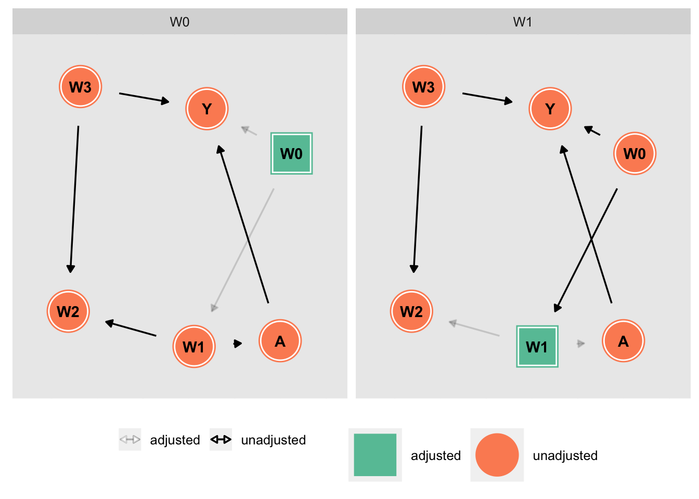

# Web link to the software

http://www.dagitty.net/dags.html

## 1. A -> Y 

```
Y O @1.000,0.000
A E @0.000,0.000

A Y
```

## 2. Variable confusora 

```
Y O @1.240,1.597
A E @-2.200,1.597
W 1 @-0.291,1.044

A Y
W A Y
```
 
## 3. Variable collider 


```
Y O @1.240,1.597
A E @-2.200,1.597
W 1 @-0.291,1.044

Y W
A Y W

```
## 4. Sesgo en M 

```
A E @-2.200,1.597
Y O @1.400,1.621
W1 1 @-2.200,-1.520
W2 1 @-0.300,-0.082
W3 1 @1.400,-1.460

W1 W2 A
W3 W2 Y
A Y

```
## 5. Situación collider confusora artículo 

```
AGE 1 @-0.341,-0.042
PRO 1 @-0.392,0.833
SBP O @1.400,1.621
SOD E @-2.207,1.591

AGE SBP SOD
SBP PRO
SOD PRO SBP
```

# Installing dagitty (R package) development version

```{r, eval = FALSE}
library(devtools)
install_github("jtextor/dagitty/r")
```

# DAGitty: Butterfly, or M-BIAS example: 
```{r}
library(dagitty)
dag <- dagitty("dag {
          A -> Y
          W1 -> A
          W0 -> W1
          W0 -> Y
          W1 -> W2
          W3 -> W2
          W3 -> Y
               }")
```

```{r}
plot(graphLayout(dag))
exposures(dag) <- c("A")
outcomes(dag) <- c("Y")
```

# Identifying parents and children

```{r}
library(ggdag)
ggdag_parents(dag, "Y", text_col = "black")
ggdag_children(dag, "A", text_col = "black")
```

# Identifying the minimal adjustment sets using DAGitty:

```{r, eval = FALSE}
ggdag_adjustment_set(dag, node_size = 14, text_col = "black") + 
  theme(legend.position = "bottom")
```



# Ejercicio:

### 1. Dibuja el siguiente DAG usando DAGitty. SOD es la exposición, y SBP la variable resultado.


### 2. ¿Qué podríamos decir sobre PRO? ¿Y sobre AGE?

### 3. ¿Por qué variables deberíamos ajustar?