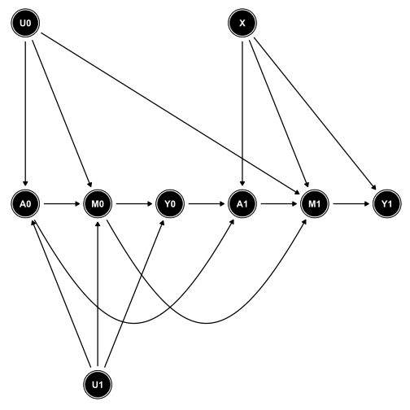

# 0. Descarga e inicialización

Hay dos opciones para descargar el paquete *ggdag*:

```{r, eval = FALSE}
# install.packages("ggdag")
```

o bien

```{r, eval = FALSE}
# devtools::install_github("malcolmbarrett/ggdag") 
```

Desde *devtools* se instala la versión 0.1.5.9000. Desde CRAN, la versión es la 0.1.0. Recomiendo la instalación desde *devtools* por la mejora realizada en *theme_dag()*.

Cargamos los paquetes *ggplot2* y *ggdag*:

```{r, echo=T, results='hide', message=F, warnings=F}
library(ggplot2)
library(ggdag)
```

# 1. Primera aproximación: A->Y

#### Definimos el DAG: "Y es la causa de A" = "A causa Y" = Y ~ A

```{r}
dag <- tidy_dagitty(dagify(Y ~ A))
```

Vemos las dos componentes del elemento *dag*:

```{r}
dag$data
dag$dag
```

Representamos el DAG:

```{r}
ggplot(dag$data, aes(x = x, y = y, xend = xend, yend = yend))+
    geom_dag_edges() +
    geom_dag_node() +
    geom_dag_text() +
    theme_dag()
```

Entendemos la razón de cada línea del código anterior:

```{r}
ggplot(dag$data, aes(x = x, y = y, xend = xend, yend = yend))
```

```{r}
ggplot(dag$data, aes(x = x, y = y, xend = xend, yend = yend))+
    geom_dag_edges()
```

```{r}
ggplot(dag$data, aes(x = x, y = y, xend = xend, yend = yend))+
    geom_dag_edges() +
    geom_dag_node()
```

```{r}
ggplot(dag$data, aes(x = x, y = y, xend = xend, yend = yend))+
    geom_dag_edges() +
    geom_dag_node() +
    geom_dag_text()
```

```{r}
ggplot(dag$data, aes(x = x, y = y, xend = xend, yend = yend))+
    geom_dag_edges() +
    geom_dag_node() +
    geom_dag_text() +
    theme_dag()
```

# 2. Variable confusora

Definimos el DAG:

```{r}
dag <- tidy_dagitty(dagify(Y ~ A + W,
                           A ~ W))
```

Representamos el DAG:

```{r}
ggplot(dag$data, aes(x = x, y = y, xend = xend, yend = yend)) +
    geom_dag_edges() +
    geom_dag_node() +
    geom_dag_text() +
    theme_dag()
```

# 3. Cambio de coordenadas

Nos puede interesar que la representación sea distinta, con las tres variables formando un triángulo.

```{r}
dag <- tidy_dagitty(dagify(Y ~ A + W,
                           A ~ W))
```

Representamos el DAG mostrando las coordenadas de los nodos.

```{r}
ggplot(dag$data, aes(x = x, y = y, xend = xend, yend = yend)) +
    geom_dag_edges() +
    geom_dag_node() +
    geom_dag_text()
```

Vamos a modificar los datos del DAG para que cada nodo aparezca donde queramos.

```{r}
dag$data
```

```{r}
# (x, y) coordenadas del nodo del que sale la flecha (name: A W W Y)
dag$data$x <- c(0, 1, 1, 2)
dag$data$y <- c(0, 1, 1, 0)

# (xend, yend) coordenadas del nodo que recibe la flecha (to: Y A Y NA)
dag$data$xend <- c(2, 0, 2, NA)
dag$data$yend <- c(0, 0, 0, NA)
```

Lo vemos con las coordenadas:

```{r}
ggplot(dag$data, aes(x = x, y = y, xend = xend, yend = yend))+
    geom_dag_edges() +
    geom_dag_node() +
    geom_dag_text()

```

El resultado final es:

```{r}
ggplot(dag$data, aes(x = x, y = y, xend = xend, yend = yend))+
    geom_dag_edges() +
    geom_dag_node() +
    geom_dag_text() +
    theme_dag()

```

# 4. Collider 

De forma similar, definimos y representamos el DAG.

```{r}

dag <- tidy_dagitty(dagify(Y ~ A,
                           W ~ A + Y))

ggplot(dag$data, aes(x = x, y = y, xend = xend, yend = yend))+
    geom_dag_edges() +
    geom_dag_node() +
    geom_dag_text() +
    theme_dag()
```

Cambiamos las coordenadas:

```{r}
dag$data
dag$data$x    <- c(0, 0, 2,  1)
dag$data$y    <- c(0, 0, 0,  1)
dag$data$xend <- c(1, 2, 1, NA)
dag$data$yend <- c(1, 0, 1, NA)
```

Volvemos a representar el DAG

```{r}
ggplot(dag$data, aes(x = x, y = y, xend = xend, yend = yend))+
    geom_dag_edges() +
    geom_dag_node() +
    geom_dag_text() +
    theme_dag() 
```

# 5. Sesgo en M

```{r}

dag <- tidy_dagitty(dagify(Y ~ A + W3,
                           W2 ~ W1 + W3,
                           A ~ W1))
```

Representamos el DAG

```{r}
ggplot(dag$data, aes(x = x, y = y, xend = xend, yend = yend))+
    geom_dag_edges() +
    geom_dag_node() +
    geom_dag_text() +
    theme_dag() 
```

Cambiamos las coordenadas

```{r}
dag$data
dag$data$x    <- c(0, 0, 0, 2, 2,  2,  1)
dag$data$y    <- c(0, 2, 2, 2, 2,  0,  1)
dag$data$xend <- c(2, 0, 1, 1, 2, NA, NA)
dag$data$yend <- c(0, 0, 1, 1, 0, NA, NA)
```

Representamos el DAG

```{r}
ggplot(dag$data, aes(x = x, y = y, xend = xend, yend = yend))+
    geom_dag_edges() +
    geom_dag_node() +
    geom_dag_text() +
    theme_dag()
```

# 6. Situación collider + confusor

```{r}
dag <- tidy_dagitty(dagify(PRO ~ SBP + SOD,
                           SBP ~ SOD + AGE,
                           SOD ~ AGE))
```

Representamos el DAG
```{r}
ggplot(dag$data, aes(x = x, y = y, xend = xend, yend = yend))+
    geom_dag_edges() +
    geom_dag_node() +
    geom_dag_text() +
    theme_dag() 
```

Cambio coordenadas

```{r}

dag$data
dag$data$x    <- c(1, 1, 2, 0, 0,  1)
dag$data$y    <- c(2, 2, 0, 0, 0,  1)
dag$data$xend <- c(2, 0, 1, 1, 2, NA)
dag$data$yend <- c(0, 0, 1, 1, 0, NA)
```

Representamos el DAG
```{r}
ggplot(dag$data, aes(x = x, y = y, xend = xend, yend = yend))+
    geom_dag_edges() +
    geom_dag_node() +
    geom_dag_text() +
    theme_dag()
```

# 7. DAG con flechas curvas

```{r}
dag <- tidy_dagitty(dagify(Y ~ U + W2 + A,
                           W2 ~ A + W1 + U,
                           A ~ W1))

dag$data

# (x, y) coordenadas del nodo del que sale la flecha
dag$data$x <- c(0, 0, 2, 2, 0, 0, 1, 2)
dag$data$y <- c(0, 0, 1, 1, 1, 1, 0, 0)

# (xend, yend) coordenadas del nodo que recibe la flecha
dag$data$xend <- c(1, 2, 1, 2, 0, 1, 2, NA)
dag$data$yend <- c(0, 0, 0, 0, 0, 0, 0, NA)
``` 

Representamos el DAG

```{r}
ggplot(dag$data, aes(x = x, y = y, xend = xend, yend = yend)) +
    geom_dag_edges_arc(curvature = c(0, -0.4, 0, 0, 0, 0, 0)) + # Flecha con curvatura
    geom_dag_node() +
    geom_dag_text() +
    theme_dag()
```

# 8. Cómo guardar un DAG

En primer lugar, creamos el DAG:

```{r}
dag <- tidy_dagitty(dagify(Y1 ~ M1 + U1,
                           M1 ~ A1 + X + M0 + U1,
                           A1 ~ U1 + A0 + Y0,
                           Y0 ~ M0 + U0,
                           M0 ~ U0 + A0 + X,
                           A0 ~ X + U0))

dag$data

# (x, y) coordenadas del nodo del que sale la flecha
dag$data$x <- c(1, 1, 4, 2, 2, 5, 1, 1, 1,  2,  2,  2, 4, 4, 4, 3, 6)
dag$data$y <- c(0, 0, 0, 0, 0, 0, 1, 1, 1, -1, -1, -1, 1, 1, 1, 0, 0)

# (xend, yend) coordenadas del nodo que recibe la flecha
dag$data$xend <- c(4, 2, 5, 5, 3, 6, 1, 2, 5, 1, 2, 3, 4, 5, 6, 4, NA)
dag$data$yend <- c(0, 0, 0, 0, 0, 0, 0, 0, 0, 0, 0, 0, 0, 0, 0, 0, NA)

# Algunas flechas deben estar curvadas
curva <- rep(0, 17)
curva[1] <- -0.4
curva[4] <- -0.4
```


Fijamos la ruta de trabajo:

```{r}
setwd("C:/Users/dredondo/Dropbox/ICI_Course/Labs/LAB4")
```

La imagen se guardará en formato *SVG* (vectorial, máxima calidad), pero también se puede usar *png*, *bmp*, *jpeg*, o *tiff*.

```{r, eval = FALSE}
svg(filename="DAG.svg")

ggplot(dag$data, aes(x = x, y = y, xend = xend, yend = yend)) +
  geom_dag_edges_arc(curvature = curva) +
  geom_dag_node() +
  geom_dag_text() +
  theme_dag()

dev.off()
```

El resultado final es:




# Ejercicio: Dibuja el siguiente DAG usando ggdag.

```{r, echo = FALSE}
dag <- tidy_dagitty(dagify(Y ~ A + W,
                           W ~ A))
dag$data$x    <- c(0, 0, 1,  2)
dag$data$y    <- c(0, 0, 1,  0)
dag$data$xend <- c(1, 2, 2, NA)
dag$data$yend <- c(1, 0, 0, NA)
ggplot(dag$data, aes(x = x, y = y, xend = xend, yend = yend))+
    geom_dag_edges() +
    geom_dag_node() +
    geom_dag_text() +
    theme_dag() 
```


